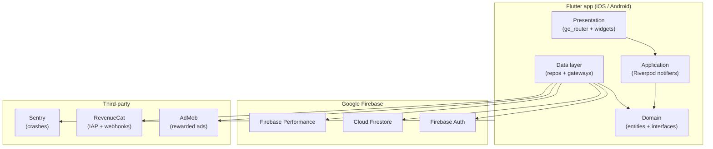
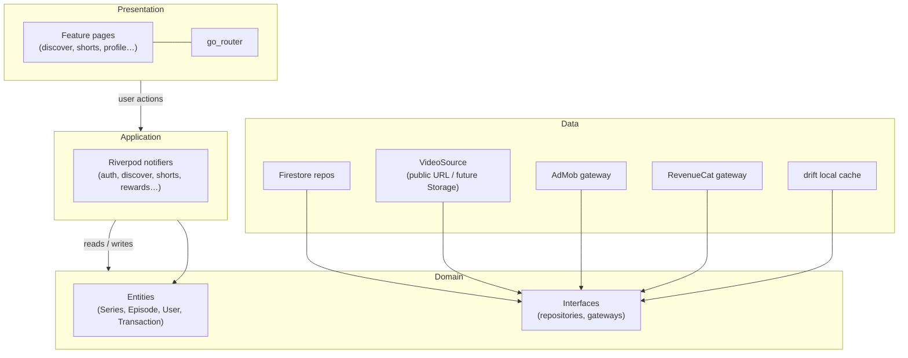
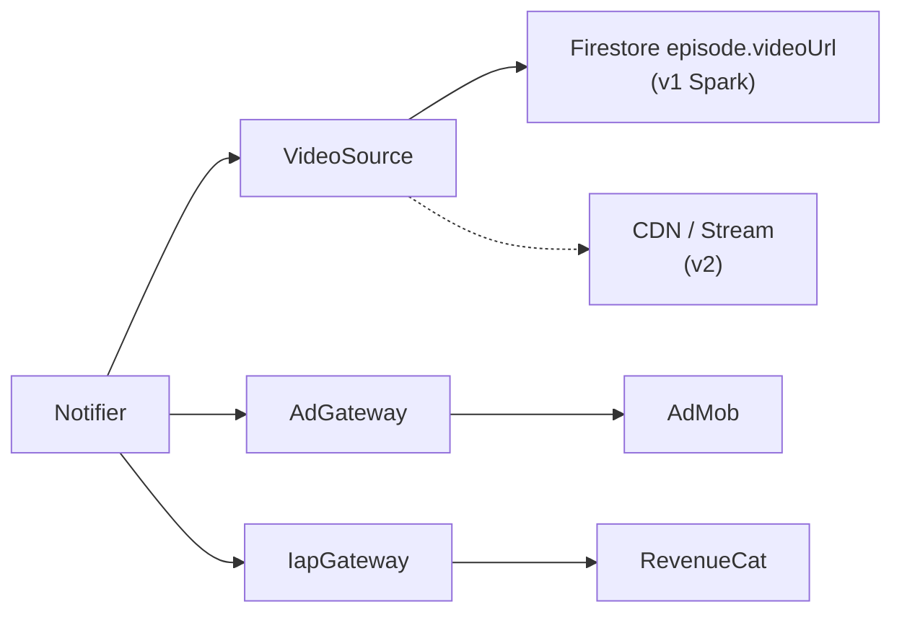
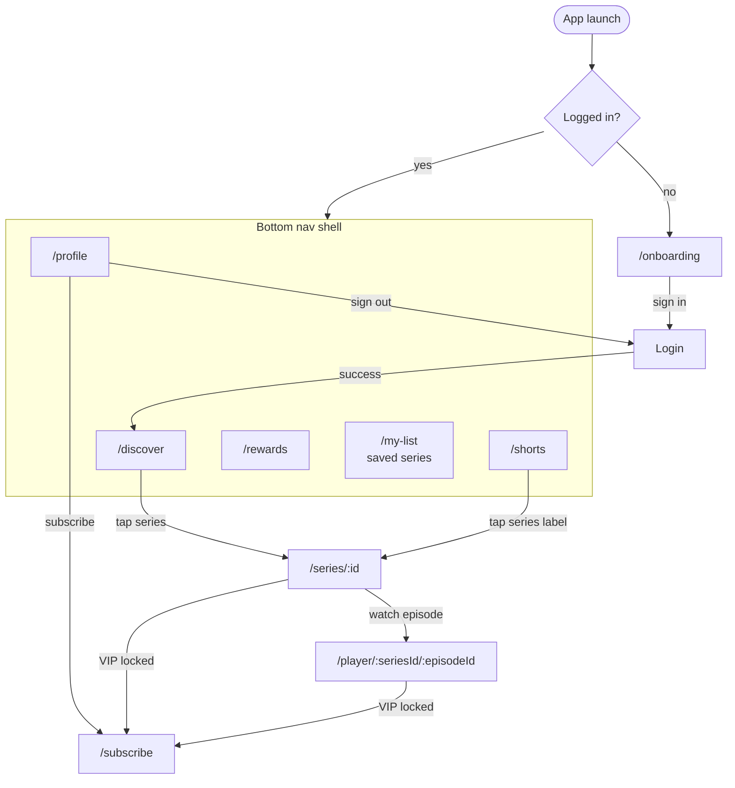
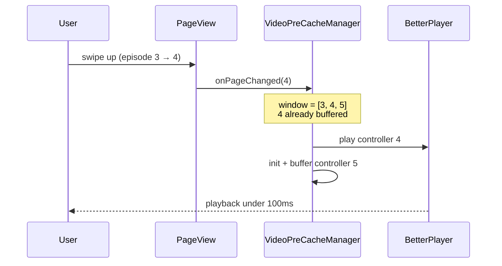
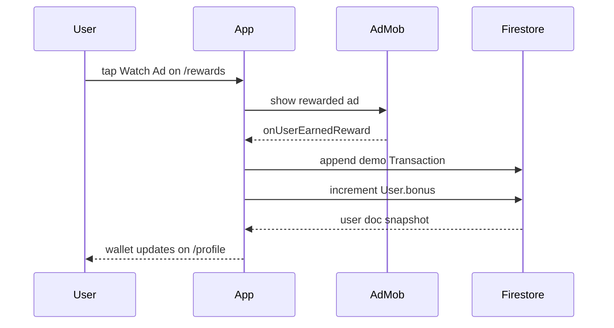
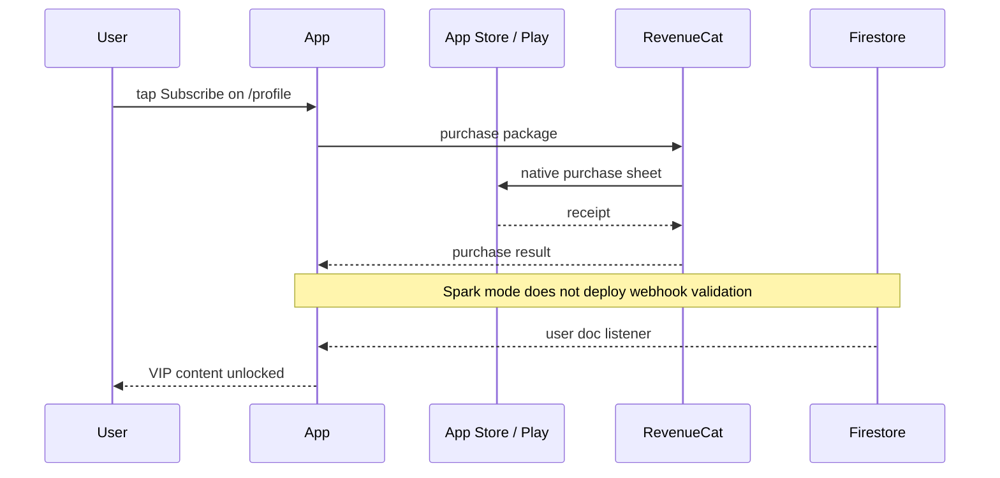
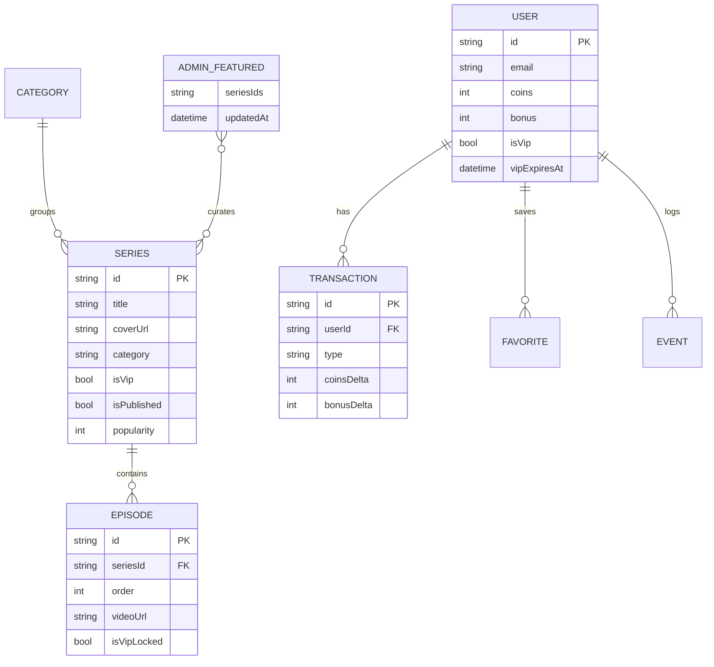
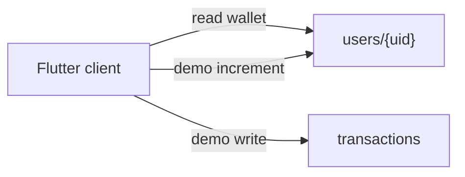

# ShortiGo

A TikTok-style **short-drama streaming app** for iOS and Android, built with Flutter.
Videos play instantly on swipe, content is organized into series, and the current
backend is configured for one **no-cost Firebase Spark** project.

> Status: **v1 MVP — feature-complete, pre-release.** The app builds, analyzes clean,
> and passes its unit/widget/integration tests. It is **not yet shippable** because it
> still needs third-party service keys, store release signing/archive work, and manual
> device QA. See [What's left](#whats-left) for the exact gaps.

---

## Table of contents

- [System overview](#system-overview)
- [Features](#features)
- [Tech stack](#tech-stack)
- [Architecture](#architecture)
- [App navigation](#app-navigation)
- [Key flows](#key-flows)
- [Project structure](#project-structure)
- [Data model](#data-model)
- [Getting started](#getting-started)
- [Running the app (flavors & config)](#running-the-app-flavors--config)
- [Backend setup (Firebase)](#backend-setup-firebase)
- [Future paid backend](#future-paid-backend)
- [Admin tooling](#admin-tooling)
- [Testing](#testing)
- [Build & release](#build--release)
- [What's left](#whats-left)
- [Roadmap (v2)](#roadmap-v2)
- [Documentation](#documentation)

---

## System overview

How the Flutter client, Firebase backend, and third-party services fit together.



---

## Features

- **Discover feed** — category tabs (For You, New, Hot, Adventure, Scary, Anime, VIP)
  with a series-card grid.
- **Series detail** — cover, description, and ordered episode list.
- **Shorts feed** — full-screen vertical `PageView` with a 3-controller pre-cache
  window so the next video is already buffered before you swipe (target: tap-to-play
  < 350 ms, zero network requests per swipe).
- **Episode player** — full-screen playback via `better_player`, using episode
  `videoUrl` values stored in Firestore.
- **Auth** — email/password and Google Sign-In (Firebase Auth). A user document is
  created on first sign-in.
- **Rewards** — daily check-in and watch-an-ad-for-bonus are demo credits written
  client-side for the Spark/free-tier MVP.
- **Wallet** — coins (paid) and bonus (earned) balances plus a transaction ledger,
  shown on the profile page.
- **VIP subscription** — RevenueCat-backed subscribe flow; locked episodes gate
  behind a subscribe CTA. Server-side webhook validation is kept as a future paid
  backend option.
- **Observability** — Sentry crash reporting + route breadcrumbs, Firebase
  Performance traces on cold start / feed load / playback, memory-pressure handling.

## Tech stack

| Layer        | Choice                                  |
|--------------|-----------------------------------------|
| Framework    | Flutter 3.22+ / Dart 3.4+               |
| State / DI   | Riverpod 2 (codegen)                    |
| Routing      | go_router                               |
| Auth         | Firebase Auth + google_sign_in          |
| Database     | Cloud Firestore                         |
| Media        | Public episode URLs in Firestore (swappable via `VideoSource`) |
| Local cache  | drift (SQLite)                          |
| Video        | better_player_plus                      |
| Ads          | google_mobile_ads (AdMob)               |
| IAP          | purchases_flutter (RevenueCat)          |
| Backend      | Firebase Spark: Auth + Firestore        |
| Errors       | sentry_flutter                          |
| Performance  | firebase_performance                    |

## Architecture

Clean-architecture-lite with four layers. Dependencies point inward; the domain layer
is pure Dart and unit-testable without mocking Firebase.



Swappable gateways (change one implementation without touching UI):



Provider swaps are isolated behind interfaces (`VideoSource`, `IapGateway`,
`AdGateway`, repositories), so e.g. moving from public URLs to Storage/CDN is a
single-file change.

## App navigation

Bottom tabs live inside a `ShellRoute`; login and subscribe sit outside the shell.



## Key flows

### Shorts swipe (pre-cache)

The next video is buffered before the user swipes, so playback feels instant.



### Watch ad → bonus (Spark demo)



### VIP subscription



## Project structure

```
lib/
├── main.dart                 # Bootstrap: Firebase, auth listener, deferred Sentry/IAP init
├── app.dart                  # MaterialApp.router + bottom-nav shell
├── bootstrap/                # Firebase init + generated options (dev/prod)
├── core/                     # Cross-cutting: env, theme, router, error, perf, providers
├── features/                 # auth, discover, shorts, series_detail, episode_player,
│                             #   rewards, subscription, profile
├── domain/                   # entities (freezed) + gateway/repository interfaces
└── data/                     # firestore, storage, ads, iap, local (drift) implementations

cloud_functions/functions/    # grantAdReward, grantDailyCheckIn, grantVipSubscription (TS)
tools/                        # seed_firestore.dart, upload_episode.dart (admin scripts)
test/                         # unit (domain + notifiers) + widget tests
integration_test/             # full-app cold-start smoke test
docs/                         # design spec, release checklist, monitoring runbook
firestore.rules               # Firestore security rules
storage-cors.json             # Storage CORS for Range requests (better_player seeking)
```

## Data model

Firestore collections and how they relate:



**Wallet trust boundary:** in Spark mode, bonus credits are demo-only client writes.
This is acceptable for a no-cost MVP demo, but production monetization needs a future
server-authoritative backend.



## Getting started

### Prerequisites

- Flutter `>=3.22.0` with Dart `>=3.4.0`
- Xcode + CocoaPods (iOS) and Android SDK + NDK (Android)
- Node.js 18+ (only for compiling optional future Cloud Functions)
- Firebase CLI (`npm i -g firebase-tools`) and the FlutterFire CLI for backend work

### Install

```bash
flutter pub get
dart run build_runner build --delete-conflicting-outputs   # freezed / json / riverpod / drift codegen
```

## Running the app (flavors & config)

Two flavors (`dev`, `prod`) are still accepted at build time via `--dart-define=ENV=…`.
All secrets are injected with `--dart-define` (defaults point at AdMob **test** IDs and
the single `shortigo-prod` Spark project).

```bash
# Dev (defaults are fine for local runs without real keys)
flutter run --dart-define=ENV=dev

# Prod with real keys
flutter run --dart-define=ENV=prod \
  --dart-define=FIREBASE_PROJECT_ID=shortigo-prod \
  --dart-define=SENTRY_DSN=... \
  --dart-define=ADMOB_APP_ID_IOS=... \
  --dart-define=ADMOB_APP_ID_ANDROID=... \
  --dart-define=ADMOB_REWARDED_IOS=... \
  --dart-define=ADMOB_REWARDED_ANDROID=... \
  --dart-define=RC_API_KEY_IOS=... \
  --dart-define=RC_API_KEY_ANDROID=...
```

See `lib/core/env/env.dart` for the full list of supported defines and their defaults.

Copy `dart_defines.example.json` for a template. AdMob app IDs are injected into **AndroidManifest** and **iOS Info.plist** from the same `--dart-define` values — see [docs/admob-setup.md](docs/admob-setup.md).

## Backend setup (Firebase)

Root-level Firebase config is committed for one Spark/free-tier project:

- `default`: `shortigo-prod`
- `prod`: `shortigo-prod`

1. Keep the project on Spark; do not enable billing.
2. Enable Firestore and Firebase Auth.
3. Generate real `firebase_options_*.dart` with `flutterfire configure` per flavor.
4. Deploy Firestore rules and indexes:

```bash
firebase use prod
firebase deploy --only firestore:rules,firestore:indexes
```

5. Use public demo media URLs in Firestore. Firebase Storage and Cloud Functions are
   intentionally not deployed in Spark mode.

## Future paid backend

TypeScript functions still live in `cloud_functions/functions/` for a future paid
production backend:

- `grantAdReward` — verifies a rewarded-ad event (rate-limited) and credits bonus.
- `grantDailyCheckIn` — enforces the once-per-day window and credits bonus.
- `grantVipSubscription` — RevenueCat webhook that flips `isVip` / `vipExpiresAt`.
- `uploadInit` / `finalizeEpisode` — paid-mode Firebase Storage upload flow.

```bash
cd cloud_functions/functions
npm install
npm run build
```

Do not run `npm run deploy` unless you intentionally upgrade to Blaze. Cloud Functions
deployment requires a billing account.

## Admin tooling

- `tools/seed_firestore.dart` — seed demo series/episodes into a project.
- `tools/upload_episode.dart` — future paid-mode upload helper for Storage/GCS.
- `admin/` — Spark-safe web CRM that uploads to Cloudinary and writes Firestore docs.
- `docs/crm-upload-schema.md` — locked Firestore/direct-URL schema for uploads.

The admin CRM uses Google Sign-In and direct Firestore writes. To allow a user to
publish, create `adminUsers/{firebaseAuthUid}` in Firestore from the Firebase Console
or set an `admin: true` custom claim from a trusted Admin SDK environment. Do not make
generic signed-in users admins.

```bash
# Requires gcloud auth and a Storage bucket; not used in Spark-only mode
dart run tools/upload_episode.dart <seriesId> <order> <video.mp4> <thumb.jpg> [isVip]
```

## Testing

```bash
flutter analyze                                  # static analysis (currently: no issues)
flutter test                                     # unit + widget tests (currently: all pass)
flutter test integration_test/app_test.dart     # cold-start integration smoke (needs a device)
```

Current coverage: domain entities (JSON round-trips, defaults), the discover notifier,
and core widgets (series card, error view, bottom-nav navigation). Wallet/rewards/IAP
notifiers and optional Cloud Functions are **not yet** unit-tested.

## Build & release

```bash
flutter build appbundle --release \
  --dart-define=ENV=prod \
  --dart-define=FIREBASE_PROJECT_ID=shortigo-prod \
  --dart-define=SENTRY_DSN=<sentry-dsn> \
  --dart-define=ADMOB_APP_ID_ANDROID=<android-admob-app-id> \
  --dart-define=ADMOB_REWARDED_ANDROID=<android-rewarded-ad-unit-id> \
  --dart-define=RC_API_KEY_ANDROID=<revenuecat-google-api-key>

flutter build ios --release \
  --dart-define=ENV=prod \
  --dart-define=FIREBASE_PROJECT_ID=shortigo-prod \
  --dart-define=SENTRY_DSN=<sentry-dsn> \
  --dart-define=ADMOB_APP_ID_IOS=<ios-admob-app-id> \
  --dart-define=ADMOB_REWARDED_IOS=<ios-rewarded-ad-unit-id> \
  --dart-define=RC_API_KEY_IOS=<revenuecat-apple-api-key>
```

Android release bundling, local upload signing, and the iOS no-codesign release build
are verified locally. On this Xcode 15.2 machine, iOS pods are pinned to Firebase Apple
SDK 11.11.0 and Google Mobile Ads SDK 11.2.0 through `google_mobile_ads` 5.1.0.
Production builds log `ShortiGo release blockers` at startup when `ENV=prod` is used
with empty service keys or Google test AdMob IDs.

## What's left

The code is feature-complete against the v1 spec, but the project **cannot be released
as-is**. Concrete blockers, roughly in priority order:

**Backend / infrastructure (hard blockers)**

- [x] Root `.firebaserc`, `firebase.json`, `firestore.indexes.json`, and Firestore
      rules are committed.
- [x] Firebase project `shortigo-prod` is created.
- [x] Firestore database, rules, and indexes are deployed for `shortigo-prod`.
- [x] Demo Firestore data is seeded into `shortigo-prod`.
- [x] Identity Toolkit/Auth API is enabled for `shortigo-prod`.
- [x] Unused Firebase project `shortigo-dev` was deleted/scheduled for deletion.
- [x] Android/iOS Firebase apps are registered and platform config files are committed.
- [x] Firebase Auth providers are enabled for Email/Password and Google.
- [x] Studio provider RBAC, audit events, and provider-scoped catalog access are
      implemented and deployed.
- [x] Production AdMob app and rewarded-ad IDs are configured locally in the
      ignored production defines file.
- [x] Sentry account/project and DSN are configured locally.
- [x] RevenueCat Test Store sandbox is configured with the `vip` entitlement,
      default offering, three products, and local sandbox API keys.
- [ ] RevenueCat production App Store/Play Store mappings and keys require the
      corresponding store app records.

**Build toolchain**

- [x] Xcode iOS 17.2 runtime/platform registration is repaired and eligible
      device/simulator destinations are available.
- [ ] Reconfirm the fresh production iOS no-codesign release build after the
      clean native dependency compilation completes.
- [x] Android release AAB builds successfully with the local SDK/NDK toolchain.
- [x] Android release signing uses local ignored `android/key.properties` when present.

**Product gaps**

- [x] `/my-list` bottom-nav tab renders saved series, and series detail supports
      Save/Unsave.
- [x] Logged-out users land on `/onboarding` with category previews before sign-in.
- [x] Mobile Firestore writes cannot self-grant VIP or coins; Spark reward increments
      are bounded by deployed rules and covered by emulator tests.
- [ ] Rewards/VIP are Spark-mode demo flows. Production-grade server validation requires
      a future paid backend or another no-cost backend provider.

**QA**

- [ ] The manual device matrix in `docs/release-checklist-v1.md` is entirely unchecked
      (cold-start timing, 50-swipe jank test, sign-in flows, ad reward, daily check-in,
      VIP grant, airplane-mode error states, crash-free rate ≥ 99.5%).

**Store and legal**

- [x] Public privacy policy is deployed at
      `https://shortigo-prod.web.app/privacy`.
- [x] Public account-deletion instructions are deployed at
      `https://shortigo-prod.web.app/account-deletion`.
- [ ] Add both URLs to Play Console and App Store Connect and complete legal
      review before submission.

See `docs/release-checklist-v1.md` for the full pre-submission list.

## Roadmap (v2)

Explicitly out of scope for v1: offline downloads, watch history, i18n, push
notifications, casting, a real recommendation algorithm, social features
(likes/comments/shares), and web/desktop/tablet layouts.

## Documentation

- `docs/superpowers/specs/2026-06-01-shortigo-design.md` — full approved design spec
  (architecture, data model, flows, performance budgets, security).
- `docs/release-checklist-v1.md` — release verification results and pre-submission tasks.
- `docs/monitoring-runbook-v1.md` — launch-week monitoring runbook (Sentry, Perf, revenue).
